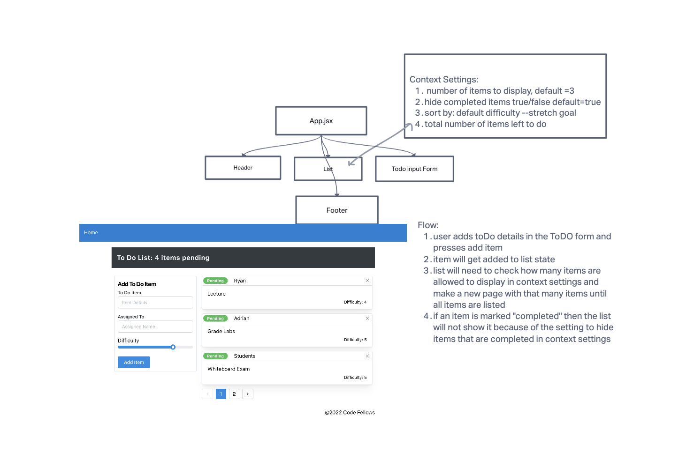

# LAB 31

[Deployed Site](timely-dusk-7e6698.netlify.app)

## App Description

 This is a simple to-do list application built with React and utilizing the Context Hook for state management. The app allows users to create, update, and delete tasks, as well as mark them as completed. It provides a clean and intuitive user interface, making it easy to manage your daily tasks effectively.
 